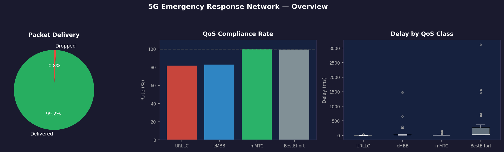
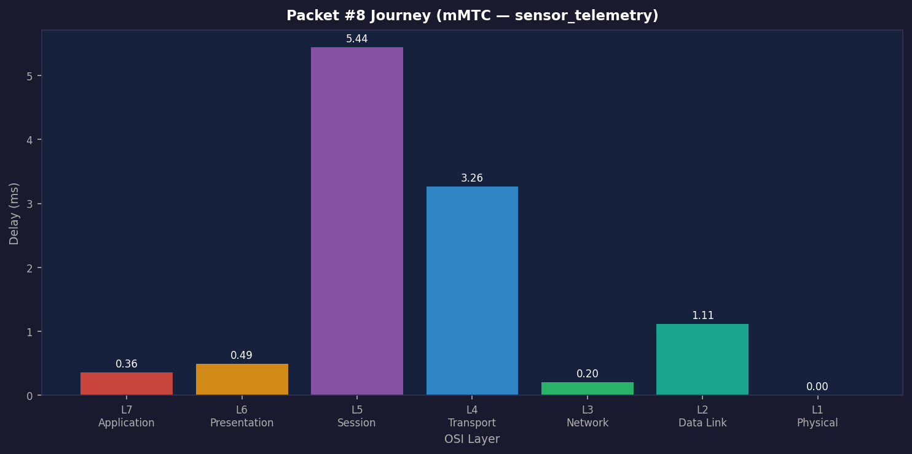

# 5G Smart City Emergency Response Network Simulation

A complete end-to-end 7-layer OSI network simulation built in Python. This project models realistic 5G wireless behavior, QoS enforcement, and per-layer processing delays for emergency response communication in smart cities.



## Project Summary

This simulator tracks the journey of network packets across all 7 OSI layers (from Physical to Application) in a dynamic smart city environment featuring moving emergency vehicles, fixed infrastructure (hospitals/dispatch), and IoT sensors. 

### Core Capabilities

- **7-Layer OSI Modeling**: Realistic packet processing, headers, and delays simulated at every layer.
- **5G QoS Classes**: Adheres to 3GPP standards including URLLC (Emergency, <10ms), eMBB (Video streams), mMTC (Sensors), and Best Effort.
- **Dynamic Node Movement**: Vehicles move dynamically within city boundaries, causing changing network topologies and routing updates.
- **Metrics & Visualization**: Generates detailed matplotlib visualizations and features an interactive Tkinter dashboard to monitor layer-specific metrics and packet journey telemetry.

## OSI Layer Breakdown

1. **Layer 1 (Physical)**: 5G channel modeling with path loss, Rayleigh fading, and adaptive modulation (BPSK to 64-QAM).
2. **Layer 2 (Data Link)**: Framing, CRC error detection, Selective Repeat ARQ, and MAC flow control.
3. **Layer 3 (Network)**: Dijkstra routing, QoS-aware paths, and congestion detection.
4. **Layer 4 (Transport)**: TCP (with congestion control) and UDP logic, modeling scheduling delays and jitter.
5. **Layer 5 (Session)**: Connection pooling, timeout management, and session lifecycle.
6. **Layer 6 (Presentation)**: Adaptive data compression, encryption overhead (AES), and encoding.
7. **Layer 7 (Application)**: Message generation by node type, QoS classification, and delivery validation.

## Packet Journey

Each packet traverses the layers, accumulating delay and overhead based on network conditions:



## Quick Start

1. **Clone the repository and enter the directory**
2. **Create and activate a virtual environment**:
   ```powershell
   python -m venv .venv
   .\.venv\Scripts\Activate.ps1
   ```
3. **Install dependencies**:
   ```powershell
   pip install numpy matplotlib networkx
   ```
4. **Run the simulation**:
   ```powershell
   python main.py
   ```

Upon running, the script simulates 60 seconds of network activity. It will output real-time progress to the console, generate 12 analytical plots in the `results/` folder, and launch the interactive Tkinter dashboard.

## Project Structure

- `main.py` & `simulation.py`: Core simulation engine orchestrating the network.
- `layer1_physical.py` to `layer7_application.py`: Implementation of each OSI layer's protocols and delays.
- `config.py`: Centralized configuration (network parameters, QoS rules, physical layer settings).
- `visualization.py` & `dashboard.py`: Analytical tools for static plots and interactive UI.


**AUTHORS--**
1.  Mayank Yadav
2.  Rai Shrijal Anjani
3.  Mayank Pratap Singh
4.  Anubhav Kishor Anand
5.  Manmath Ramachandra Mahajan
